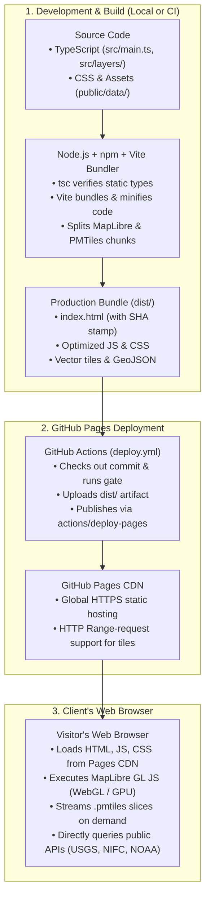
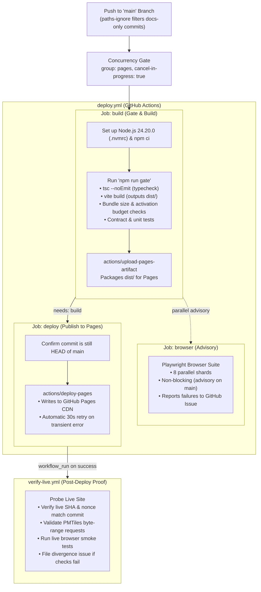

# Dynamic Drought Module: Architecture & Deployment

## Overview & Repository Documents

The **Dynamic Drought Module (DDM)** is an embeddable, serverless interactive web map of North American drought, wildfire, heat, and telemetry indicators built by **ATNI Climate** (Affiliated Tribes of Northwest Indians).

### Core Repository Documentation
- [README.md](README.md): Product scope, hazard coverage, sovereign data stewardship, and iframe embedding.
- [DEVELOPER.md](DEVELOPER.md): Developer guide, layer contracts, offline data pipelines, and testing ladders.
- [ROADMAP.md](ROADMAP.md): Implementation phases, integration branch posture, and decision registers (see also [docs/ROADMAP.yaml](docs/ROADMAP.yaml)).
- [EXPLAIN_NPM.md](EXPLAIN_NPM.md): Comprehensive markdown reference on Node, npm, Vite, and GitHub Pages.

::: {.notes}
DDM is designed so any deployer can host a static copy on standard web infrastructure with zero telemetry and zero backend maintenance.
:::

## The Paradigm: Server-Driven vs. Static Web Apps

Why can a complex mapping application run on **GitHub Pages** without a server?

::: {.columns}
::: {.column width="50%"}
### Server-Driven (Shiny / Streamlit)
- Requires an active **R or Python server** running 24/7.
- Server re-calculates data and re-renders plots on every user interaction.
- Scaling requires provisioning CPU, RAM, and managing worker processes.
- Fails if the server backend crashes.
:::

::: {.column width="50%"}
### Static Client-Side (DDM on Pages)
- **Zero application backend**.
- TypeScript is pre-compiled into static HTML, JavaScript, and CSS.
- **Client GPU** renders map vectors via **WebGL** (MapLibre GL JS).
- Hosted cheaply and reliably on GitHub Pages' global CDN.
- Fetches static vector tiles (`.pmtiles`) via HTTP range requests.
:::
:::

## High-Level System Architecture



## Tooling Rosetta Stone for Non-Web Developers

Coming from Python (`pip`/`conda`) or R (`renv`/`devtools`)? Here is the mapping:

| Tool / File | Purpose | Python Equivalent | R Equivalent | Role in DDM |
| :--- | :--- | :--- | :--- | :--- |
| **Node.js** | JS runtime outside browser | `python3` runtime | `R` runtime | Executes build scripts and tests |
| **`.nvmrc`** | Pins Node version | `.python-version` (pyenv) | `.Rversion` | Enforces exact Node **24.20.0** |
| **npm** | Package & script manager | `pip` + `poetry` | `install.packages` + `renv` | Manages dependencies & tasks |
| **`package.json`** | Project manifest | `pyproject.toml` | `DESCRIPTION` | Defines metadata, deps & scripts |
| **`package-lock.json`** | Cryptographic lockfile | `poetry.lock` | `renv.lock` | Guarantees exact dependency tree |
| **`npm ci`** | Deterministic install | `pip install --no-deps` | `renv::restore()` | Clean install strictly from lockfile |
| **TypeScript** | Static type checking | `mypy` / type hints | Type annotations | Catches type bugs at build time |
| **Vite** | Dev server & bundler | Webpack / Sphinx | Quarto / `pkgdown` | Fast HMR & production bundler |
| **Playwright** | Browser automation | `pytest-playwright` | `shinytest2` | Headless browser integration tests |

## Core Configuration: `.nvmrc` & `package.json`

### 1. Pinned Node Version (`.nvmrc`)
- Holds `24.20.0` (Active LTS).
- Used locally via `nvm use` and in CI via `actions/setup-node`.

### 2. Dependency Manifest (`package.json`)
- **Runtime Dependencies**:
  - `maplibre-gl`: WebGL mapping engine.
  - `pmtiles`: Cloud-optimized vector tile reader.
  - `@preact/signals`: Fine-grained reactive UI state.
- **Key Task Scripts**:
  - `npm run dev`: Launch local Vite dev server at `http://localhost:5173`.
  - `npm run build`: Typecheck and produce `dist/` bundle.
  - `npm run preview`: Serve `dist/` locally at `http://localhost:4173`.
  - `npm run gate`: Run full build, bundle budget, and schema checks.

## Bundling & Optimization: `vite.config.ts`

Key architectural decisions configured in `vite.config.ts`:

1. **Relative Asset URLs (`base: './'`)**:
   - Ensures the app runs seamlessly at domain root, on GitHub Pages subpaths (`/dynamic-drought-module/`), or embedded inside an `<iframe>`.
2. **Build Stamping**:
   - Embeds `DDM_BUILD_SHA` and `DDM_BUILD_NONCE` into the DOM.
   - Allows browser integration tests and release workflows to prove exactly which commit is executing.
3. **Vendor Chunk Splitting**:
   - Isolates `maplibre-gl` (~800 kB) and `pmtiles` into distinct cache groups.
   - App code changes do not invalidate large vendor libraries in the user's browser cache.

## Local Developer Verification Ladder

As detailed in [DEVELOPER.md](DEVELOPER.md), development follows a local-first verification ladder:

```bash
# 1. Clean installation matching lockfile
npm ci

# 2. Interactive local development with Hot Module Replacement
npm run dev

# 3. Fast syntax, type, and vocabulary checks (~5 seconds)
npm run verify:quick

# 4. Deterministic quality gate (~40 seconds)
npm run gate

# 5. Full serial Playwright browser test suite
npm run test:serial
```

::: {.callout-note}
Always run `npm run gate` before pushing. It validates bundle size ceilings, activation budgets, and upstream schema contracts.
:::

## GitHub Actions Deployment Pipeline

The workflow in `.github/workflows/deploy.yml` orchestrates builds and deployments on pushes to `main`:



## Release Evidence & Live Verification

In DDM, **a merged commit is not proof of a successful release**.

### `.github/workflows/verify-live.yml`
Runs automatically upon completion of the deploy workflow:

1. **Build Nonce & SHA Check**:
   - Queries the live site and reads `document.documentElement.dataset.ddmBuildSha`.
   - Confirms the CDN is actively serving the exact merged commit, not a stale cache.
2. **Byte-Range Capability**:
   - Asserts HTTP `206 Partial Content` on large `.pmtiles` archives to ensure fast vector tile streaming.
3. **Live Browser Boots**:
   - Executes automated browser boots against live URLs to test view state, embedded mode, and layer loading.
4. **Issue Management**:
   - Automatically opens or updates a single tracked issue if any divergence is found.

## Summary & Next Steps

::: {.columns}
::: {.column width="50%"}
### Summary of Principles
- **Serverless & Embeddable**: Pure static files running on standard CDNs.
- **Local-First Verification**: Fast feedback loops before code ever hits Git.
- **Sovereign Stewardship**: Real-time sovereign boundaries fetched live in browser sessions, never stored or redistributed.
- **Empirical Release Evidence**: Automated verification of live CDN bytes.
:::

::: {.column width="50%"}
### Further Reading
- [README.md](README.md): Product scope & embed instructions.
- [DEVELOPER.md](DEVELOPER.md): Comprehensive developer guidelines.
- [ROADMAP.md](ROADMAP.md): Project roadmap & delivery posture.
- [EXPLAIN_NPM.md](EXPLAIN_NPM.md): Full narrative walkthrough of npm & GitHub Pages.
:::
:::
